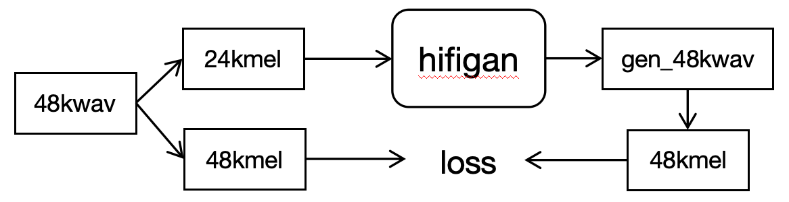
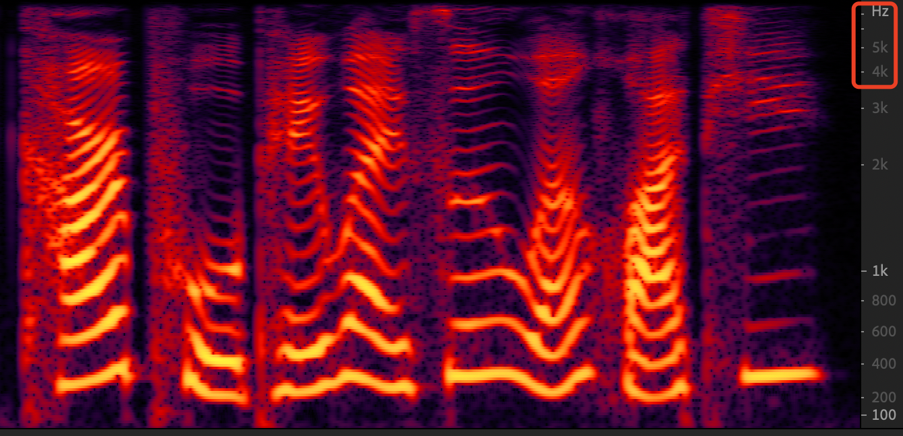
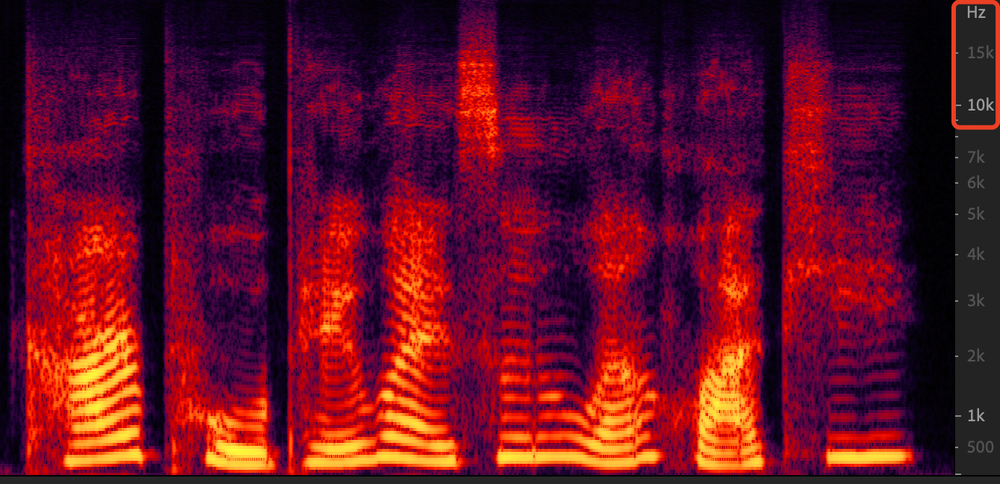

## Pre-requisites
1. Python == 3.8
2. Clone this repository.
3. Install python requirements. Please refer [requirements.txt](requirements.txt)
4. Download a 48k dataset, such as [genshin](https://github.com/AI-Hobbyist/Genshin_Datasets) or VCTK.
## SR model sample theory


## SR results
- origin 16k mel-spectrum

- generated 48k mel-spectrum



## Training
```
CUDA_VISIBLE_DEVICES="3" python train.py \
--config config_v2_16k_to_48k.json \
--input_wavs_dir VCTK-Corpus/wav48/,genshin --checkpoint_path exp/v2_16k_to_48k/
```
To train 24k_to_48k, replace `config_v2_16k_to_48k.json` with `config_v2_24k_to_48k.json`.<br>
Checkpoints and copy of the configuration file are saved in `checkpoint_path` directory by default.<br>
You can change the path by adding `--checkpoint_path` option.
1. The hifigan training speed may be a bit slow. You can use [HiFTNet-sr](https://github.com/liuhuang31/HiFTNet-sr) to accelerate training, and its generate result may be sounds better.


## Pretrained Model
1. The pretrained models provided is in "exp/v2_16k_to_48k/g_00120000", trained with StarRail_Datasets and VCTK.
2. For i don't have GPU resources, a kind person(@Lucy) train config_v2_16k_to_48k version and trained stop at 120k, not trained enough. So the results maybe sounds a little electronic, but verified that model methods is valid.
3. You can use other hifigan config version to train, or use [HiFTNet-sr](https://github.com/liuhuang31/HiFTNet-sr).


## Inference from wav file
1. Make `test_files` directory and copy wav files into the directory.
2. Run the following command.
    ```
    # python inference.py --checkpoint_file [generator checkpoint file path]
    CUDA_VISIBLE_DEVICES="-1" python inference.py --checkpoint_file exp/v1_16k_to_48k/g_00120000 --input_wavs_dir LJSpeech-BZNSYP-16k
    ```
Generated wav files are saved in `generated_files` by default.<br>
You can change the path by adding `--output_dir` option.


## Reference
Our repository is heavily based on jik876
's [hifi-gan](https://github.com/jik876/hifi-gan).
